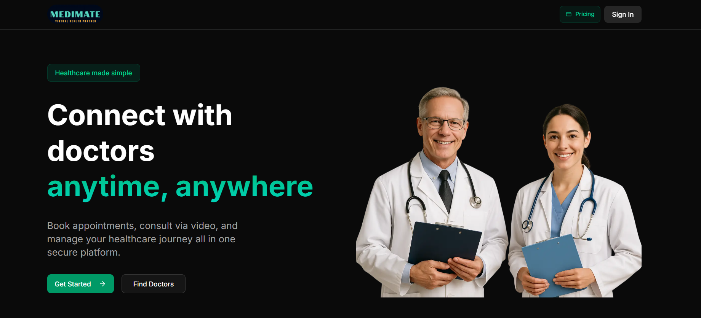

<h1 align="center">MediMate 🩺 <br> Connect with Doctors Anytime, Anywhere 🌍</h1>



**MediMate** — An online doctor appointment & platform — One‑on‑one video consultations, role-based authentication for Patients and Doctors, subscription-based credits, doctor verification, booking flow with real‑time available slots, doctor & admin dashboards, and secure payouts.

---

## ✨ Features

**👩‍⚕️ For Patients**
- 📝 Create profile & browse doctors by specialty.
- 📅 Book appointments with live available slots.
- 🎥 Join secure video consultations (Vonage).
- 💳 Buy credits or monthly subscription packages.
- 📖 View medical history and past appointments.

**🧑‍⚕️ For Doctors**
- 🛡️ Sign up and submit credentials for admin approval.
- ⏰ Set availability (time slots).
- 👥 Manage appointments and consult with patients.
- 💵 Track earnings and request payouts.

**👨‍💼 For Admins**
- ✅ Approve or reject doctor applications.
- 👥 Manage users and payouts.
- 📊 Oversee platform activity.

---

## 🛠 Tech Stack

- **Frontend:** ⚛️ Next.js (App Router), React, Tailwind CSS, Shadcn UI
- **Backend:** 🟩 Node.js, Next.js API routes  
- **Database:** 🗄 NeonDB with Prisma ORM  
- **Video Calls:** 🎥 Vonage Video API  
- **Authentication & Payments:** 💳 Clerk  
- **Deployment:** ☁️ Vercel

---

## 🚀 Getting Started

### 📥 Installation
```bash
git clone <repo-url> medimate
cd medimate
npm install
```

### ⚙️ Setup Environment
Create a `.env` file with keys like:
```env
NEXT_PUBLIC_CLERK_PUBLISHABLE_KEY = your_clerk_publishable_key
CLERK_SECRET_KEY = your_clerk_secret_key
NEXT_PUBLIC_CLERK_SIGN_IN_URL=/sign-in
NEXT_PUBLIC_CLERK_SIGN_UP_URL=/sign-up
NEXT_PUBLIC_CLERK_AFTER_SIGN_IN_URL=/onboarding
NEXT_PUBLIC_CLERK_AFTER_SIGN_UP_URL=/onboarding

NEXT_PUBLIC_VONAGE_APPLICATION_ID = your_vonage_application_id
VONAGE_PRIVATE_KEY = lib/private.key

DATABASE_URL = your_database_url
```

### 🗄 Database Setup
```bash
npx prisma migrate dev
npx prisma generate
```

### ▶️ Run Project
```bash
npm run dev
```

---

## 📂 Project Structure
```
MediMate/
├─ .next/
├─ app/
│  ├─ (auth)/         # sign in / sign up / onboarding routes
│  ├─ (main)/         # public pages (home, pricing, about)
│  │  ├─ globals.css
│  │  ├─ layout.js
│  │  └─ page.js
│  ├─ doctors/        # doctor listing & profile pages
│  ├─ appointments/   # booking flow, join meeting pages
│  └─ dashboard/      # doctor & admin dashboards (role-based)
├─ components/        # shared React components (cards, modals)
├─ hooks/             # custom hooks (useAuth, useBookings, useVonage)
├─ lib/               # helper utilities (vonage helpers, stripe, auth)
├─ prisma/
│  ├─ schema.prisma
│  └─ migrations/
├─ public/            # images, icons
├─ middleware.js      # route protection and role-based redirects
├─ next.config.mjs
├─ package.json
├─ postcss.config.mjs
└─ README.md
```


---

## 🔄 How It Works

1. 🙋 Patients or Doctors sign up.  
2. 🛡️ Admin verifies doctor credentials.  
3. 📅 Doctors set availability.  
4. 👩‍⚕️ Patients book slots using credits.  
5. 🎥 Both join secure video call at scheduled time.  
6. 📝 Doctors add notes; patients can view history.  
7. 💰 Doctors request payouts, admins process them.
---

## 🤝 Contributing

Contributions are welcome! Fork this repo and submit a pull request.

---

<h3 align="center">2025 ©️ Samriddho Biswas</h3>